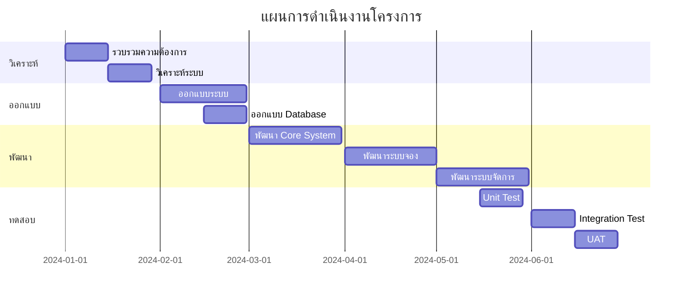

# แผนการบริหารจัดการโครงการ
# (Project Management Plan)

## ระบบจองห้องพักออนไลน์
## Online Hotel Booking System

| รหัสเอกสาร | PMP-HOTEL-2024 |
|------------|----------------|
| เวอร์ชัน | 1.0 |
| วันที่ | 3 ธันวาคม 2024 |

บริษัท Example Software จำกัด

---
## ประวัติการแก้ไขเอกสาร

| เวอร์ชัน | วันที่ | รายละเอียดการแก้ไข | ผู้จัดทำ | ผู้อนุมัติ |
|---------|-------|-------------------|---------|-----------|
| 1.0 | 03/12/2024 | จัดทำเอกสารครั้งแรก | [ชื่อ-นามสกุล] | [ชื่อ-นามสกุล] |

---
## สารบัญ
1. วัตถุประสงค์การจัดทำแผนบริหารจัดการโครงการ
2. แนวทางในการบริหารจัดการโครงการ
3. รายละเอียดความต้องการ
4. รายการที่ต้องส่งมอบตามข้อกำหนดโครงการ
5. โครงสร้างคณะทำงานและความรับผิดชอบ
6. ตารางเวลาโครงการ
7. อุปกรณ์และเครื่องใช้ที่จำเป็น
8. การบริหารจัดการความเสี่ยง
9. Project Infrastructure, Repository & Quality Management System
   - 9.1 Project Repository
   - 9.2 การตั้งชื่อไฟล์ในโครงการ
   - 9.3 การควบคุมเวอร์ชั่น
   - 9.4 การ Backup และ Recovery

---
## 1. วัตถุประสงค์การจัดทำแผนบริหารจัดการโครงการ

เอกสารฉบับนี้จัดทำขึ้นเพื่อเป็นแนวทางในการบริหารจัดการโครงการพัฒนาระบบจองห้องพักออนไลน์ โดยมีวัตถุประสงค์ดังนี้:
1. เพื่อกำหนดแนวทางและวิธีการบริหารจัดการโครงการให้สำเร็จตามเป้าหมาย
2. เพื่อใช้เป็นเครื่องมือในการติดตามและควบคุมการดำเนินงานโครงการ
3. เพื่อให้ทีมงานทุกคนเข้าใจบทบาทหน้าที่และแนวทางการทำงานที่ชัดเจน
4. เพื่อบริหารจัดการทรัพยากรของโครงการให้มีประสิทธิภาพ

## 2. แนวทางในการบริหารจัดการโครงการ

โครงการนี้จะใช้แนวทางการพัฒนาแบบ Agile โดยมีหลักการสำคัญดังนี้:
1. แบ่งการพัฒนาเป็น Sprint ขนาด 2 สัปดาห์
2. จัดประชุม Daily Standup ทุกวันเวลา 10:00 น.
3. Sprint Planning ทุกต้น Sprint
4. Sprint Review และ Retrospective ทุกสิ้น Sprint
5. ใช้ Jira เป็นเครื่องมือในการติดตามงาน
6. ทำ Code Review ก่อน Merge ทุกครั้ง

## 3. รายละเอียดความต้องการ

| รหัส | ความต้องการ | ลำดับความสำคัญ | ผู้รับผิดชอบ |
|-----|------------|----------------|-------------|
| R01 | ระบบค้นหาและจองห้องพัก | สูง | ทีม Frontend |
| R02 | ระบบชำระเงินออนไลน์ | สูง | ทีม Backend |
| R03 | ระบบจัดการห้องพัก | กลาง | ทีม Backend |
| R04 | ระบบรายงาน | ต่ำ | ทีม Frontend |
| R05 | ระบบจัดการผู้ใช้ | สูง | ทีม Backend |

## 4. รายการที่ต้องส่งมอบ

| รหัส | รายการส่งมอบ | กำหนดส่ง | เกณฑ์การยอมรับ |
|-----|--------------|-----------|----------------|
| D01 | SRS Document | สัปดาห์ที่ 2 | ผ่านการรับรองจาก Stakeholders |
| D02 | System Design | สัปดาห์ที่ 4 | ผ่านการ Review จากทีมเทคนิค |
| D03 | Working Prototype | สัปดาห์ที่ 8 | ผ่านการทดสอบจากผู้ใช้ |
| D04 | Production System | สัปดาห์ที่ 24 | ผ่าน UAT และ Security Test |

## 5. โครงสร้างคณะทำงาน

| ตำแหน่ง | ชื่อ | ความรับผิดชอบ | ทักษะที่ต้องการ |
|---------|-----|----------------|----------------|
| Project Manager | นาย ก | บริหารโครงการ | PMP, Agile |
| Tech Lead | นาย ข | ดูแลด้านเทคนิค | Fullstack, AWS |
| Frontend Dev (3) | ทีม A | พัฒนา UI | React, TypeScript |
| Backend Dev (3) | ทีม B | พัฒนา API | Node.js, SQL |
| QA (2) | ทีม C | ทดสอบระบบ | Test Automation |

## 6. ตารางเวลาโครงการ



## 7. อุปกรณ์และเครื่องใช้ที่จำเป็น

| ประเภท | รายการ | จำนวน | วัตถุประสงค์ |
|--------|---------|--------|-------------|
| Hardware | Laptop (Dev) | 8 | พัฒนาระบบ |
| Hardware | Server | 3 | Dev, Staging, Prod |
| Software | IDE License | 8 | พัฒนาโปรแกรม |
| Software | AWS Credit | - | Cloud Infrastructure |
| Tools | Jira License | 10 | Project Management |

## 8. การบริหารจัดการความเสี่ยง

| รหัส | ความเสี่ยง | ผลกระทบ | โอกาสเกิด | มาตรการป้องกัน |
|------|-----------|----------|------------|----------------|
| R01 | ทีมขาดประสบการณ์ | สูง | กลาง | จัดอบรม, มี Tech Lead สอนงาน |
| R02 | Requirements เปลี่ยน | สูง | สูง | ใช้ Agile, มี Buffer 20% |
| R03 | Third-party API ล่าช้า | กลาง | สูง | มี Mock Service, เตรียม Plan B |

## 9. Project Infrastructure, Repository & Quality Management System

### 9.1 Project Repository
- Git Repository Structure:
  ```
  /src
    /frontend
    /backend
    /docs
    /tests
  ```
- Access Control:
  - Developer: Read/Write ใน branch ของตัวเอง
  - Tech Lead: Merge สู่ main branch
  - QA: Read-only และ Write ใน test branch

### 9.2 การตั้งชื่อไฟล์ในโครงการ
- เอกสาร: `[ProjectCode]_[DocType]_[Version].[ext]`
- Source Code: 
  - Components: `PascalCase.tsx`
  - Utilities: `camelCase.ts`
  - Constants: `UPPER_SNAKE_CASE.ts`

### 9.3 การควบคุมเวอร์ชั่น
- Git Flow:
  - main: Production code
  - develop: Development code
  - feature/*: New features
  - hotfix/*: Bug fixes
- Semantic Versioning: MAJOR.MINOR.PATCH

### 9.4 การ Backup และ Recovery
- Automated Backup:
  - Source Code: GitHub
  - Database: Daily backup to S3
  - Documents: SharePoint with version control
- Recovery Plan:
  - RTO: 4 hours
  - RPO: 24 hours
  - Recovery Steps documented in DR plan
